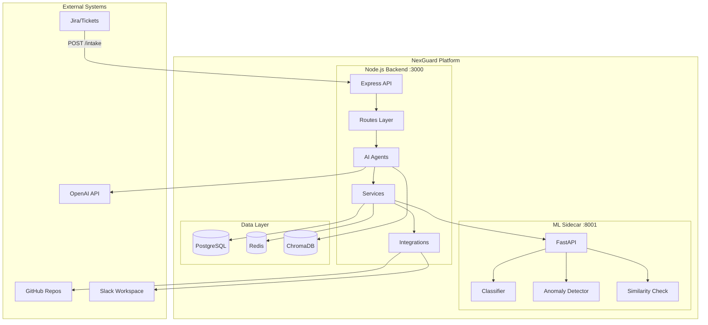
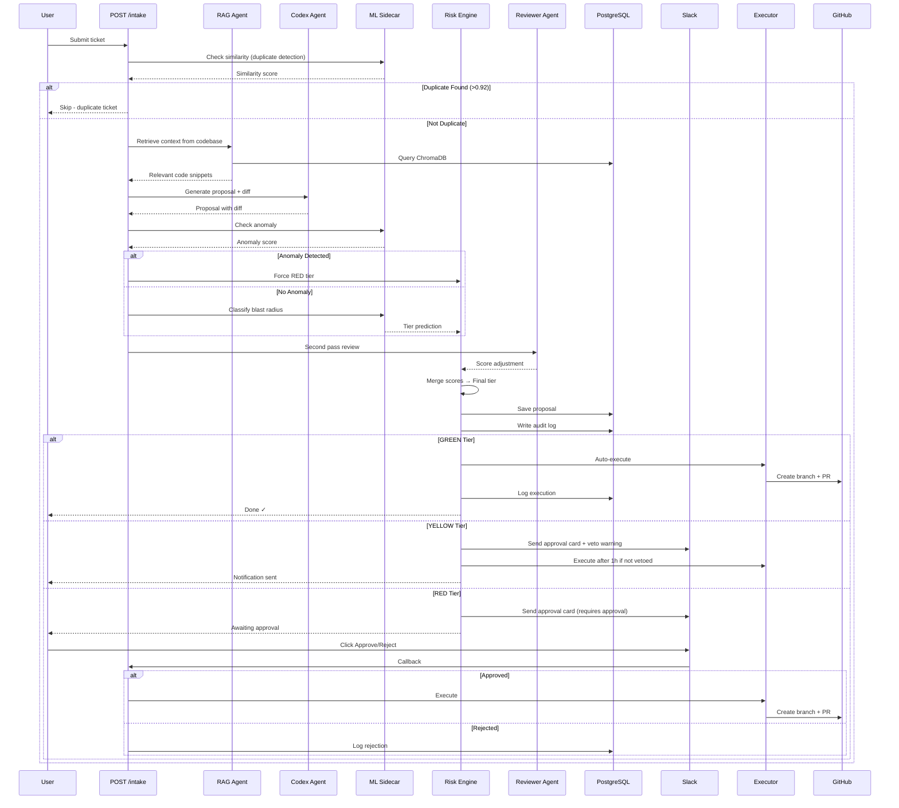
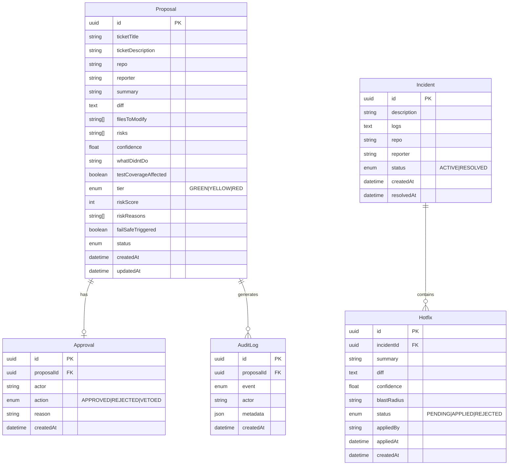

# NexGuard Architecture Diagram

## System Overview

NexGuard is a human-governed AI coding agent orchestration platform that intercepts AI-generated code changes, scores their blast radius, and routes them through a risk-tiered approval system.

```
┌──────────────────────────────────────────────────────────────────────────┐
│                         NexGuard Platform                                 │
│                                                                           │
│  ┌─────────────┐      ┌──────────────┐      ┌─────────────────────┐    │
│  │   Ticket    │──────▶│  Node.js     │◀────▶│  Python ML Sidecar  │    │
│  │   Input     │       │  Backend     │      │    (FastAPI)        │    │
│  │  (Jira)     │       │  (Express)   │      │    Port 8001        │    │
│  └─────────────┘       │  Port 3000   │      └─────────────────────┘    │
│                        └──────┬───────┘                                  │
│                               │                                           │
│              ┌────────────────┼────────────────┐                         │
│              │                │                │                          │
│         ┌────▼────┐     ┌────▼─────┐    ┌────▼──────┐                  │
│         │PostgreSQL│     │  Redis   │    │  ChromaDB │                  │
│         │  5433    │     │  6379    │    │ (Vector)  │                  │
│         └──────────┘     └──────────┘    └───────────┘                  │
│                                                                           │
│         External Integrations:                                           │
│         ┌──────────┐  ┌──────────┐  ┌──────────────┐                   │
│         │ OpenAI   │  │  GitHub  │  │    Slack     │                   │
│         │ GPT-4o   │  │ (Octokit)│  │  Webhooks    │                   │
│         └──────────┘  └──────────┘  └──────────────┘                   │
└──────────────────────────────────────────────────────────────────────────┘
```

## High-Level Architecture



## Component Architecture

### Node.js Backend (Port 3000)

```
src/
├── index.ts                          # Express app entry point
├── routes/                           # HTTP endpoints
│   ├── intake.ts                     # POST /intake - Ticket submission
│   ├── incident.ts                   # POST /incident - Incident declaration
│   ├── approval.ts                   # GET /approve/:id, /reject/:id, /diff/:id
│   ├── audit.ts                      # GET /audit/feed, /audit/report
│   └── slack.ts                      # POST /slack/events - Interactive components
│
├── agents/                           # AI-powered agents
│   ├── codex.ts                      # GPT-4o proposal generation
│   ├── rag.ts                        # RAG context retrieval (ChromaDB)
│   ├── reviewer.ts                   # GPT-4o second reviewer pass
│   ├── incident.ts                   # Hotfix ranking (45s countdown)
│   └── communication.ts              # PR descriptions, postmortems, changelogs
│
├── services/                         # Business logic
│   ├── riskEngine.ts                 # ML-assisted blast radius scoring
│   ├── executor.ts                   # Applies diffs, opens PRs
│   └── audit.ts                      # Append-only audit log writer
│
├── integrations/                     # External service connectors
│   ├── slack.ts                      # Approval cards, notifications
│   └── github.ts                     # Repo context, diff application, PR creation
│
├── lib/
│   └── prisma.ts                     # Prisma client singleton
│
├── config/
│   └── policy.ts                     # Loads policy.yaml configuration
│
└── types/
    └── index.ts                      # Shared TypeScript types
```

### Python ML Sidecar (Port 8001)

```
ml/
├── main.py                           # FastAPI app
│   ├── GET  /health                  # Health check
│   ├── POST /classify                # Blast radius classification
│   ├── POST /anomaly                 # Anomaly detection
│   └── POST /similarity              # Duplicate detection
│
├── classify.py                       # CodeBERT fine-tuned classifier
├── anomaly.py                        # PyTorch autoencoder
├── similarity.py                     # Cosine similarity via embeddings
│
├── models/                           # Saved model weights
│   ├── blast_radius_classifier/      # Fine-tuned CodeBERT
│   └── anomaly_detector.pt           # Trained autoencoder
│
└── train/                            # Training scripts
    ├── generate_data.py              # GPT-4o synthetic data generation
    ├── train_classifier.py           # Fine-tune CodeBERT
    ├── train_autoencoder.py          # Train anomaly detector
    └── data/                         # Training JSONL files
```

## Core Data Flow - Development Ticket



## Approval Flow (Slack Integration)

```
┌─────────────────────────────────────────────────────────────────────┐
│                    Slack Approval Workflow                          │
└─────────────────────────────────────────────────────────────────────┘

  Risk Engine                Slack                   Approval Handler
      │                        │                            │
      │  sendApprovalCard()   │                            │
      │──────────────────────▶│                            │
      │   Block Kit Card      │                            │
      │   ┌────────────────┐  │                            │
      │   │ 🔴 RED Tier    │  │                            │
      │   │ Risk: 85/100   │  │                            │
      │   │ Files: auth.ts │  │                            │
      │   │                │  │                            │
      │   │ [Approve]      │  │                            │
      │   │ [Reject]       │  │                            │
      │   │ [View Diff]    │  │                            │
      │   └────────────────┘  │                            │
      │                        │                            │
      │                        │  User clicks [Approve]    │
      │                        │──────────────────────────▶│
      │                        │                            │
      │                        │       POST /slack/events   │
      │                        │       action: approve     │
      │                        │                            │
      │                        │                   ┌────────▼────────┐
      │                        │                   │ Parse payload   │
      │                        │                   │ Extract action  │
      │                        │                   │ proposalId      │
      │                        │                   └────────┬────────┘
      │                        │                            │
      │                        │                   ┌────────▼─────────┐
      │                        │                   │ prisma.transaction│
      │                        │                   │ 1. Create Approval│
      │                        │                   │ 2. Update Proposal│
      │                        │                   │ 3. Write AuditLog │
      │                        │                   └────────┬─────────┘
      │                        │                            │
      │                        │                   ┌────────▼────────┐
      │                        │                   │ Call Executor   │
      │                        │                   │ Apply diff      │
      │                        │                   │ Open PR         │
      │                        │                   └─────────────────┘
      │                        │                            │
      │                        │◀───────────────────────────┘
      │                        │       200 OK               
      │                        │                            
      │  Update message        │                            
      │◀───────────────────────│                            
      │  "✓ Approved by Alice" │                            
      │                        │                            
```

## ML Pipeline Detail

```
┌──────────────────────────────────────────────────────────────────────┐
│                         ML Pipeline Flow                              │
└──────────────────────────────────────────────────────────────────────┘

Ticket Input
     │
     ▼
┌──────────────────────┐
│ /similarity          │  ← Feature 3: Duplicate Detection
│ Cosine similarity    │    - Embed ticket via OpenAI
│ Check ChromaDB       │    - Query similar proposals
│ Threshold: 0.92      │    - Skip if match found
└─────────┬────────────┘
          │ No duplicate
          ▼
┌──────────────────────┐
│ RAG Context Retrieval│
│ - Embed ticket       │
│ - Query ChromaDB     │
│ - Get relevant code  │
└─────────┬────────────┘
          │
          ▼
┌──────────────────────┐
│ Codex Agent (GPT-4o) │
│ Generate proposal    │
│ + diff + risks       │
└─────────┬────────────┘
          │
          ▼
┌──────────────────────┐
│ /anomaly             │  ← Feature 2: Anomaly Detection
│ PyTorch autoencoder  │    - Trained on GREEN proposals
│ Reconstruction error │    - High error → force RED
│ Saved: anomaly.pt    │
└─────────┬────────────┘
          │
          ▼
┌──────────────────────┐
│ /classify            │  ← Feature 1: Blast Radius Classifier
│ Fine-tuned CodeBERT  │    - microsoft/codebert-base
│ 3 tiers: G/Y/R       │    - Fallback to rules if conf < 0.8
│ Saved: blast_radius/ │
└─────────┬────────────┘
          │
          ▼
┌──────────────────────┐
│ Reviewer Agent       │
│ GPT-4o second pass   │
│ Score adjustment     │
└─────────┬────────────┘
          │
          ▼
┌──────────────────────┐
│ Risk Engine          │
│ Merge all scores     │
│ Apply policy rules   │
│ Final tier: G/Y/R    │
└─────────┬────────────┘
          │
          ▼
    Decision Point
          │
    ┌─────┴─────┬──────────┐
    │           │          │
┌───▼───┐  ┌───▼────┐  ┌──▼──┐
│ GREEN │  │ YELLOW │  │ RED │
│ Auto  │  │ Notify │  │Block│
└───────┘  └────────┘  └─────┘
```

## Database Schema



## API Endpoints

### Routes Overview

```
┌─────────────────────────────────────────────────────────────────────┐
│                         API Endpoints                                │
└─────────────────────────────────────────────────────────────────────┘

Development Flow:
  POST   /intake                 Submit ticket → full ML pipeline
  
Incident Response:
  POST   /incident               Declare incident → hotfix ranking
  
Human Approval:
  GET    /approve/:id            Approve proposal (Slack callback)
  GET    /reject/:id             Reject proposal (Slack callback)
  GET    /diff/:id               View proposal diff + details
  
Audit & Governance:
  GET    /audit/feed             Real-time audit log stream
  GET    /audit/report           Generate compliance report
  
Slack Integration:
  POST   /slack/events           Interactive component callbacks
  
System:
  GET    /health                 Health check
```

### Request/Response Examples

#### POST /intake
```json
Request:
{
  "title": "Add authentication to API",
  "description": "Implement JWT auth for /api routes",
  "repo": "nexguard-org/demo-app",
  "reporter": "alice"
}

Response (GREEN):
{
  "proposalId": "uuid-123",
  "tier": "GREEN",
  "status": "AUTO_EXECUTED",
  "prUrl": "https://github.com/org/repo/pull/42"
}

Response (RED):
{
  "proposalId": "uuid-456",
  "tier": "RED",
  "status": "AWAITING_APPROVAL",
  "slackNotificationSent": true
}
```

#### GET /diff/:id
```json
Response:
{
  "id": "uuid-123",
  "title": "Add authentication to API",
  "summary": "Added JWT middleware...",
  "diff": "diff --git a/src/auth.ts...",
  "tier": "RED",
  "riskScore": 85,
  "riskReasons": [
    "Modifies authentication logic",
    "Affects all API endpoints"
  ],
  "confidence": 0.92,
  "filesToModify": ["src/auth.ts", "src/middleware.ts"],
  "status": "AWAITING_APPROVAL"
}
```

## Incident Response Flow

```
┌─────────────────────────────────────────────────────────────────────┐
│                   Incident Response Workflow                         │
└─────────────────────────────────────────────────────────────────────┘

User reports incident
      │
      ▼
POST /incident
  {
    description: "Orders API returning 500",
    logs: "sqlalchemy.exc.OperationalError...",
    repo: "demo-app",
    reporter: "charlie"
  }
      │
      ▼
┌─────────────────────┐
│ Incident Agent      │
│ - Analyze logs      │
│ - Identify root     │
│ - Generate hotfixes │
│ - Rank by safety    │
└──────────┬──────────┘
           │
           ▼
┌─────────────────────┐
│ Create Hotfix       │
│ candidates (3-5)    │
│ - Summary           │
│ - Diff              │
│ - Blast radius      │
│ - Confidence        │
└──────────┬──────────┘
           │
           ▼
┌─────────────────────┐
│ Send to Slack       │
│ 45-second countdown │
│ [Apply Hotfix #1]   │
│ [Apply Hotfix #2]   │
│ [Skip All]          │
└──────────┬──────────┘
           │
    User selects
           │
           ▼
┌─────────────────────┐
│ Apply Hotfix        │
│ - Create PR         │
│ - Update incident   │
│ - Write audit log   │
└──────────┬──────────┘
           │
           ▼
    Incident resolved
```

## Risk Tier Decision Matrix

```
┌────────────────────────────────────────────────────────────────────┐
│                     Risk Tier Rules                                │
└────────────────────────────────────────────────────────────────────┘

GREEN (Auto-Execute):
  ✓ Risk score < 30
  ✓ No security-sensitive files
  ✓ No database schema changes
  ✓ Documentation/comments/tests only
  ✓ No anomaly detected
  ✓ Confidence > 0.8
  
  Action: Execute immediately, log only

YELLOW (Execute + Notify):
  ✓ Risk score 30-60
  ✓ Non-critical business logic
  ✓ Config changes (non-prod)
  ✓ Performance optimizations
  ✓ No anomaly detected
  
  Action: Execute + notify, 1-hour veto window

RED (Hard Block):
  ✓ Risk score > 60
  ✓ Authentication/authorization changes
  ✓ Database migrations
  ✓ Production config changes
  ✓ Anomaly detected (force RED)
  ✓ ML confidence < 0.8 (failsafe)
  ✓ Affects multiple services
  
  Action: Block until human approval

Failsafe:
  ✗ ML sidecar unavailable → RED
  ✗ Any exception in scoring → RED
  ✗ Anomaly detected → RED (override)
```

## Technology Stack

```
┌────────────────────────────────────────────────────────────────────┐
│                      Technology Stack                              │
└────────────────────────────────────────────────────────────────────┘

Backend:
  • Node.js + TypeScript
  • Express.js (Web framework)
  • Prisma (ORM)
  • BullMQ (Job queue)
  
ML/AI:
  • Python 3.11 + FastAPI
  • PyTorch (Anomaly detection)
  • HuggingFace Transformers (CodeBERT)
  • scikit-learn (Cosine similarity)
  • OpenAI GPT-4o (Code generation, review)
  • OpenAI text-embedding-3-small (RAG embeddings)
  
Databases:
  • PostgreSQL (Primary data store)
  • Redis (Queue + cache)
  • ChromaDB (Vector database for RAG)
  
Integrations:
  • GitHub (Octokit) - PR creation, repo access
  • Slack - Webhooks + Interactive Components
  • OpenAI API - GPT-4o + embeddings
  
Infrastructure:
  • Docker + Docker Compose
  • Docker containers for all services
  
Frontend (Dashboard):
  • Next.js (React)
  • Real-time audit feed
  • Proposal visualization
```

## Communication Agent Outputs

```
┌────────────────────────────────────────────────────────────────────┐
│                  Communication Agent Functions                     │
└────────────────────────────────────────────────────────────────────┘

1. PR Description Generation
   Input:  Proposal ID
   Reads:  Proposal + AuditLog (full history)
   Output: Markdown PR description
     • Summary
     • Changes Made
     • Risk Assessment
     • Testing
     • Reviewer Notes
   
2. Postmortem Generation
   Input:  Incident ID
   Reads:  Incident + Hotfixes + AuditLog
   Output: Markdown postmortem
     • Incident Summary
     • Root Cause
     • Timeline
     • Resolution
     • Action Items
     • Lessons Learned
   
3. Changelog Generation
   Input:  List of Proposal IDs
   Reads:  Proposals + AuditLog
   Output: Markdown changelog
     • Features
     • Improvements
     • Bug Fixes
     • Breaking Changes
     • Other Changes

All outputs are GPT-4o generated from audit trail (not live state).
```

## Deployment Architecture

```
┌────────────────────────────────────────────────────────────────────┐
│                    Docker Compose Setup                            │
└────────────────────────────────────────────────────────────────────┘

docker-compose.yml:

┌─────────────────┐
│   PostgreSQL    │
│   port: 5433    │  ← Primary database
│   Volume: data  │
└────────┬────────┘
         │
         │
┌────────▼────────┐
│     Redis       │
│   port: 6379    │  ← Queue + cache
│   Volume: data  │
└────────┬────────┘
         │
         │
┌────────▼────────┐     ┌──────────────┐
│   ML Sidecar    │     │  Node.js App │
│   port: 8001    │◀───▶│  port: 3000  │
│   FastAPI       │     │   Express    │
│   Volume: models│     │  Volume: db  │
└─────────────────┘     └──────┬───────┘
         │                     │
         │                     │
         └──────┬──────────────┘
                │
         Shared ChromaDB
         Vector database

All services communicate via Docker network.
Environment variables in .env file.
```

## Security & Governance

```
┌────────────────────────────────────────────────────────────────────┐
│                  Security & Governance Layer                       │
└────────────────────────────────────────────────────────────────────┘

Audit Trail (Append-Only):
  ✓ Every action logged to AuditLog table
  ✓ Immutable record (no updates/deletes)
  ✓ Actor, timestamp, metadata tracked
  ✓ Full event history for compliance
  
Events Tracked:
  • PROPOSED         - Proposal created
  • AUTO_EXECUTED    - GREEN tier auto-execution
  • APPROVAL_SENT    - Slack notification sent
  • APPROVED         - Human approval
  • REJECTED         - Human rejection
  • VETOED           - YELLOW tier veto
  • EXECUTED         - Diff applied to repo
  • FAILED           - Execution failure
  • INCIDENT_DECLARED - Incident created
  • HOTFIX_APPLIED   - Hotfix applied
  • ARTIFACT_GENERATED - Documentation generated

Atomic Transactions:
  ✓ All database writes use prisma.$transaction()
  ✓ Approval + Status + AuditLog in single transaction
  ✓ Rollback on any failure
  
Fail-Safe Rules:
  ✓ ML errors → force RED tier
  ✓ Unknown exceptions → RED tier
  ✓ Anomaly detected → force RED (override)
  ✓ Low confidence → RED tier
  ✓ Slack failure → log but don't block

Policy Configuration:
  config/policy.yaml:
    • Risk thresholds
    • File pattern rules
    • Approval requirements
    • Veto windows
    • Notification routing
```

## Key Design Principles

1. **Every Codex action is a proposal** - Never execute without review
2. **Fail-safe to RED** - All errors result in human approval required
3. **Audit everything** - Append-only immutable log
4. **Atomic transactions** - All or nothing database updates
5. **ML as advisor** - Humans make final decisions
6. **Graceful degradation** - System works even if ML sidecar is down
7. **Full SDLC coverage** - Development → Testing → Deployment → Incidents

---

**NexGuard Architecture v1.0** | Built for hackathon demo | Production-ready patterns
